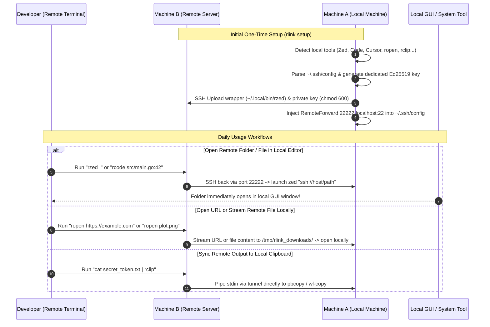

# rlink 🔗

Bridge your remote terminal sessions (Ghostty, Alacritty, iTerm2, tmux) to your local machine with a single command (`rzed .`, `rcode .`, `rcursor .`, `ropen <file>`, `rclip`).

---

## 🚀 Quick Installation

### One-line Install (macOS & Linux):
```bash
curl -fsSL https://raw.githubusercontent.com/quaywin/rlink/main/install.sh | bash
```

### Go Install:
```bash
go install github.com/quaywin/rlink@latest
```

### Build from Source:
```bash
git clone https://github.com/quaywin/rlink.git
cd rlink
go build -o rlink .
```

---

## ⚡ Quick Start

```bash
# 1. Run the interactive setup wizard on your local machine
rlink setup

# 2. On your remote server terminal, instantly trigger local actions:
rzed .                                  # Open remote folder in local Zed
rcode src/main.rs:42                    # Open file at line 42 in local VS Code
ropen https://github.com/quaywin/rlink  # Open URL in local browser
ropen plot.png                          # Stream remote image & open locally
cat token.txt | rclip                   # Copy remote output to local clipboard
rpaste > config.yaml                    # Paste local clipboard into remote file
```

---

## 💡 The Problem & Solution

When developing inside a remote server over SSH, everyday local workflows become frustrating friction points:
- Opening folders in your local GUI editor (**Zed**, **VS Code**, **Cursor**, **Windsurf**, **Sublime Text**).
- Opening web previews or docs in your local browser (`open https://...` or `xdg-open`).
- Viewing generated images, plots, or PDF reports locally without manual SFTP/rsync downloads.
- Copying text or command output from the server into your local system clipboard (`pbcopy` / `wl-copy` / `xclip`).

`rlink` is an automated CLI wizard running on your **local machine** (macOS/Linux) that solves this completely:
1. 🔍 **Discovers local tools & editors** across macOS and Linux native environments.
2. 📖 **Parses `~/.ssh/config`** to select the target remote host.
3. 🔀 **Configures reverse connectivity** via **Reverse SSH Tunnel** (`RemoteForward`).
4. 🔐 **Configures isolated Ed25519 authentication** for seamless, passwordless triggers.
5. 🚀 **Provisions zero-dependency POSIX shell wrappers** onto your remote server (`~/.local/bin/`).

---

## 🔄 Architecture & Flow Diagram



---

## 🎯 Supported Tools & "r<tool>" Naming Convention

`rlink` uses the clean, intuitive **`r<tool>`** naming convention (where `r` stands for **remote** or **rlink**):

### 1. GUI Code Editors
| Tool | Remote Command | What It Does |
| :--- | :--- | :--- |
| **Zed** | **`rzed .`** | Opens current remote directory in local **Zed** |
| **VS Code** | **`rcode .`** | Opens current remote directory in local **VS Code** |
| **Cursor** | **`rcursor .`** | Opens current remote directory in local **Cursor** |
| **Windsurf** | **`rwindsurf .`** | Opens current remote directory in local **Windsurf** |
| **VS Code Insiders** | **`rcode-insiders .`** | Opens current remote directory in local **VS Code Insiders** |
| **Sublime Text** | **`rsubl .`** | Opens current remote directory in local **Sublime Text** |

### 2. System Utilities & Clipboard
| Tool | Remote Command | What It Does |
| :--- | :--- | :--- |
| **Web & File Opener** | **`ropen <url-or-file>`** | Opens URLs in local browser, or streams remote files to view locally |
| **Clipboard Copy** | **`command \| rclip`** | Copies remote piped stdin, text, or file directly into local clipboard |
| **Clipboard Paste** | **`rpaste > file`** | Streams local clipboard content into remote terminal stdout |
| **Custom Command** | **`r<cmd> [args...]`** | Runs any local binary (`mpv`, `git-gui`, etc.) triggered from remote |

You can also customize the name with `--name` / `-n`, and deploy multiple tools on the same server. `rlink` automatically detects and reuses existing reverse tunnels!

```bash
# Example 1: Wrap Zed as 'rzed' (default)
rlink setup --tool zed --host dev-server

# Example 2: Wrap Web/File Opener as 'ropen' (reuses existing tunnel)
rlink setup --tool open --host dev-server

# Example 3: Wrap Clipboard Copy as 'rclip'
rlink setup --tool clip --host dev-server

# Example 4: Wrap a custom local command (e.g. mpv media player)
rlink setup --tool mpv --name rmpv --host dev-server
```

---

## 🔌 Advanced Setup: Eternal Terminal (et), tmux & Sleep Auto-Reconnect

### 1. Using with Eternal Terminal (`et`)
[Eternal Terminal (ET)](https://eternalterminal.dev) is a popular remote shell that automatically reconnects across laptop sleep, IP roaming, and network switches over UDP.

While `et` automatically reads `LocalForward` from `~/.ssh/config`, it requires the `-r` flag for reverse tunnels (`RemoteForward`). To make `rlink` wrappers (`rzed`, `rcode`, `ropen`, etc.) work seamlessly inside `et`:

```bash
# Connect with persistent reverse tunnel:
et -r 22222:22 my-server

# Or with persistent workspace managers (tmux / herdr):
et -r 22222:22 my-server -c "herdr"
```

> [!TIP]
> **Pro-Tip: Create a Shell Alias**  
> Add this alias to your local `~/.config/fish/config.fish` or `~/.zshrc` so you never have to remember the flag:
> ```fish
> # In ~/.config/fish/config.fish:
> alias etm="et -r 22222:22 my-server -c 'herdr'"
> ```
> Now whenever you launch `etm`, your terminal AND reverse tunnel auto-reconnect instantly after laptop sleep!

---

### 2. Standard OpenSSH: Preventing Idle Timeout
To keep standard SSH sessions alive during long periods of inactivity, add keep-alive directives to your local `~/.ssh/config`:

```ssh
Host my-server
    ServerAliveInterval 30
    ServerAliveCountMax 3
    TCPKeepAlive yes
    RemoteForward 22222 localhost:22
```
This sends null packets every 30 seconds to prevent Wi-Fi routers and NAT firewalls from dropping the idle TCP tunnel.

---

### 3. Always-On Background Tunnel (macOS LaunchAgent)
If you want the `rlink` reverse tunnel to run permanently in the background 24/7 (auto-starting on boot and reconnecting immediately whenever your Mac wakes from sleep):

Create `~/Library/LaunchAgents/dev.quaywin.rlink.tunnel.plist`:
```xml
<?xml version="1.0" encoding="UTF-8"?>
<!DOCTYPE plist PUBLIC "-//Apple//DTD PLIST 1.0//EN" "http://www.apple.com/DTDs/PropertyList-1.0.dtd">
<plist version="1.0">
<dict>
    <key>Label</key>
    <string>dev.quaywin.rlink.tunnel</string>
    <key>ProgramArguments</key>
    <array>
        <string>/usr/bin/ssh</string>
        <string>-N</string>
        <string>-T</string>
        <string>-o</string>
        <string>ServerAliveInterval=15</string>
        <string>-o</string>
        <string>ServerAliveCountMax=3</string>
        <string>my-server</string>
    </array>
    <key>RunAtLoad</key>
    <true/>
    <key>KeepAlive</key>
    <true/>
</dict>
</plist>
```
Load the agent:
```bash
launchctl load ~/Library/LaunchAgents/dev.quaywin.rlink.tunnel.plist
```

---

## 🛠️ CLI Commands & Subcommands

### 1. `rlink setup`
Interactive wizard to configure local tools and provision remote wrappers.
```bash
# Interactive TUI Wizard
rlink setup

# Or non-interactive with flags:
rlink setup --tool zed --name rzed --host dev-server --yes
rlink setup --tool open --name ropen --host dev-server --yes
rlink setup --tool clip --name rclip --host dev-server --yes
```

**Flags:**
- `-t, --tool string`: Target tool or command (`zed`, `code`, `cursor`, `windsurf`, `open`, `clip`, `paste`, or custom command)
- `-e, --editor string`: Target GUI editor (alias for `--tool`)
- `-n, --name string`: Custom remote wrapper command name (default: `rzed`, `rcode`, `ropen`, `rclip`, etc.)
- `-H, --host string`: Remote SSH host alias from `~/.ssh/config` or `user@hostname`
- `-p, --port int`: Remote Forward port (default: `22222`)
- `-y, --yes`: Automatically deploy without interactive confirmation prompt

---

### 2. `rlink status` (alias: `rlink list`, `rlink ls`)
Inspect `~/.ssh/config` and show all hosts configured with `rlink` reverse tunnels.
```bash
# Quick overview:
rlink status

# Live connection check and wrapper discovery:
rlink status --check
```

---

### 3. `rlink remove` (alias: `rlink rm`, `rlink uninstall`)
Clean up configuration and remote wrappers for a target host.
```bash
# Interactive removal:
rlink remove

# Target specific host and wrapper:
rlink remove dev-server --wrapper rzed --yes

# Remove all wrappers (rzed, rcode, ropen, rclip, rpaste):
rlink remove dev-server --wrapper all --yes
```

---

### 4. `rlink completion`
Generate shell autocompletion scripts for `zsh`, `bash`, `fish`, or `powershell`.
```bash
# Zsh (macOS / Linux):
rlink completion zsh > "${fpath[1]}/_rlink"

# Bash:
rlink completion bash > /etc/bash_completion.d/rlink

# Fish:
rlink completion fish > ~/.config/fish/completions/rlink.fish
```

---

### 5. `rlink version`
Displays semantic version, target OS, architecture, and compiler runtime information.

---

## 🏗️ Architecture & Project Layout

Aligned with the standard Go project structure and `agys`:

```
rlink/
├── .github/
│   └── workflows/
│       ├── ci.yml              # Multi-OS CI matrix (Ubuntu & macOS)
│       └── release.yml         # GitHub Actions GoReleaser automation
├── .goreleaser.yaml            # Multi-arch GoReleaser v2 configuration
├── AGENTS.md                   # Agent development rules and safety standards
├── GEMINI.md                   # AI consistency guidelines
├── LICENSE                     # MIT License
├── README.md                   # Project documentation
├── cmd/                        # Cobra CLI commands
│   ├── completion.go           # Shell autocompletion
│   ├── remove.go               # Wrapper uninstaller & config rollback
│   ├── root.go                 # Root command & version integration
│   ├── setup.go                # Interactive TUI Wizard (Charm huh) & CLI flags
│   ├── status.go               # Host & tunnel status viewer
│   └── version.go              # Version command
├── install.sh                  # One-line curl installer for macOS & Linux
├── main.go                     # Application entrypoint calling cmd.Execute()
├── pkg/                        # Core reusable libraries
│   ├── auth/                   # Isolated Ed25519 key management & authorized_keys
│   │   ├── key.go
│   │   └── key_test.go
│   ├── config/                 # OpenSSH config parser & RemoteForward injector
│   │   ├── model.go
│   │   ├── ssh_config.go
│   │   └── ssh_config_test.go
│   ├── detector/               # Local tool, editor & SSH daemon discovery
│   │   ├── tool.go
│   │   ├── tool_test.go
│   │   ├── ssh_daemon.go
│   │   └── ssh_daemon_test.go
│   ├── remote/                 # Remote SSH client, session detection & wrapper deployment
│   │   ├── session.go
│   │   ├── session_test.go
│   │   └── ssh.go
│   ├── template/               # Zero-dependency POSIX script generators
│   │   ├── wrapper.go
│   │   ├── wrapper.sh.tmpl         # Editor launcher template
│   │   ├── wrapper_opener.sh.tmpl  # Web & file opener template
│   │   ├── wrapper_clip.sh.tmpl    # Clipboard copy template
│   │   ├── wrapper_paste.sh.tmpl   # Clipboard paste template
│   │   ├── wrapper_custom.sh.tmpl  # Custom command template
│   │   └── wrapper_test.go
│   └── version/                # Build-time version metadata
│       └── version.go
├── go.mod
└── go.sum
```

---

## 🔐 Security & Zero Remote Dependencies

1. **Pure POSIX `/bin/sh` Remote Wrappers**:
   - Zero Python, Node.js, Ruby, or package manager requirements on the remote server.
   - Robust path resolution fallback ladder (`realpath` $\rightarrow$ `readlink -f` $\rightarrow$ POSIX `cd && pwd`).
   - Line and column position preservation (`file.rs:42:5`).
   - Pure POSIX file streaming over SSH without requiring `scp` or `rsync`.

2. **Dedicated Ed25519 Keypair**:
   - `rlink` creates an isolated keypair at `~/.ssh/rlink_ed25519` rather than exposing your personal master keys.
   - The public key is securely added to local `~/.ssh/authorized_keys` with strict file permissions (`0600`).
   - The private key is transferred to `~/.ssh/rlink_id_ed25519` on the remote server with `chmod 600`.

---

## ❓ Troubleshooting

### 1. "Local SSH server is not listening on port 22" (macOS)
On macOS, incoming SSH connections must be enabled:
1. Open **System Settings** $\rightarrow$ **General** $\rightarrow$ **Sharing**.
2. Turn ON **Remote Login**.
3. (Alternatively via terminal): `sudo systemsetup -setremotelogin on`

### 2. "Command not found" on Remote Server
If you run `rzed .` or `ropen` and receive `command not found`, ensure `~/.local/bin` is in your remote `$PATH`.
Add this line to your remote `~/.bashrc` or `~/.zshrc`:
```bash
export PATH="$HOME/.local/bin:$PATH"
```

### 3. Testing Connectivity
Run the built-in diagnostic test directly from your remote machine:
```bash
rzed -c     # or: rcode -c, ropen -c, rclip -c
```
This tests network connectivity back to your local machine and prints actionable tips if the reverse tunnel is inactive.

### 4. "ssh: connect to host 127.0.0.1 port 22222: Connection refused"
This indicates that the reverse tunnel is not currently listening on the remote server:
- **Using Eternal Terminal (`et`)**: Remember to connect using `et -r 22222:22 <host>`. Standard `et` sessions do not establish `RemoteForward` tunnels by default.
- **Laptop Woke from Sleep**: When a laptop sleeps, OpenSSH drops the TCP tunnel. Reconnect via `ssh <host>` (or see [Advanced Setup](#-advanced-setup-eternal-terminal-et-tmux--sleep-auto-reconnect)).
- **Session Multiplexing (ControlMaster)**: If you logged in before running `rlink setup`, dynamically attach the tunnel on your local machine without restarting:
  ```bash
  ssh -O forward -R 22222:localhost:22 <host>
  ```

---

## 📄 License

MIT License © 2026 Thang Nguyen
