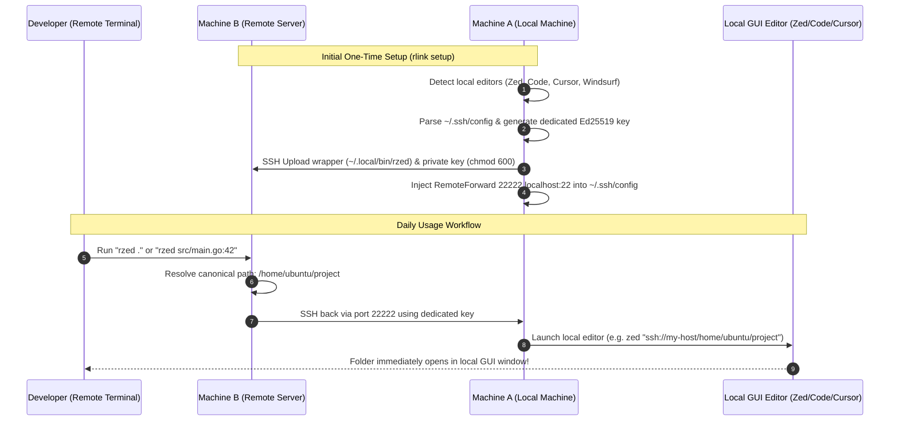

# rlink 🔗

Bridge your remote terminal sessions (Ghostty, Alacritty, iTerm2, tmux) to your local GUI editors (**Zed**, **VS Code**, **Cursor**, **Windsurf**, **Sublime Text**) with a single command (`rzed .`, `rcode .`, `rcursor .`, `rwindsurf .`).

---

## 💡 The Problem & Solution

When developing inside a remote server over SSH, opening the current directory in a local GUI editor usually requires complex manual steps: opening a new window locally, selecting Remote-SSH, navigating folders, or setting up reverse tunnels by hand.

`rlink` is an automated CLI wizard that runs on your **local machine**:
1. 🔍 **Detects your installed GUI editors** (Zed, VS Code, Cursor, Windsurf, VS Code Insiders, Sublime Text).
2. 📖 **Parses `~/.ssh/config`** to let you pick the remote server.
3. 🔀 **Configures reverse connectivity** via **Reverse SSH Tunnel** (`RemoteForward`).
4. 🔐 **Configures isolated Ed25519 authentication** for seamless, passwordless triggers.
5. 🚀 **Provisions a zero-dependency POSIX shell wrapper script** onto your remote server (`~/.local/bin/`).

---

## 🔄 Architecture & Flow Diagram



---

## 🎯 Multi-Editor Support & "r<editor>" Naming Convention

`rlink` uses the clean, intuitive **`r<editor>`** naming convention (where `r` stands for **remote** or **rlink**):

| Local GUI Editor | Remote Command | What It Does |
| :--- | :--- | :--- |
| **Zed** | **`rzed .`** | Opens current remote directory in local **Zed** |
| **VS Code** | **`rcode .`** | Opens current remote directory in local **VS Code** |
| **Cursor** | **`rcursor .`** | Opens current remote directory in local **Cursor** |
| **Windsurf** | **`rwindsurf .`** | Opens current remote directory in local **Windsurf** |
| **VS Code Insiders** | **`rcode-insiders .`** | Opens current remote directory in local **VS Code Insiders** |
| **Sublime Text** | **`rsubl .`** | Opens current remote directory in local **Sublime Text** |

You can also customize the name with `--name` / `-n`, and wrap multiple editors on the exact same server. `rlink` automatically detects and reuses existing reverse tunnels!

```bash
# Example 1: Wrap Zed as 'rzed' (default)
rlink setup --editor zed --host dev-server

# Example 2: Wrap VS Code as 'rcode' on the same server (automatically reuses existing tunnel!)
rlink setup --editor code --host dev-server

# Example 3: Wrap Cursor as 'rcursor'
rlink setup --editor cursor --host dev-server
```

Once provisioned, simply type on your remote terminal:
```bash
# On your remote server:
rzed .              # Opens current directory in Zed locally
rzed src/main.rs:42 # Opens file at line 42 in Zed locally
rcode .             # Opens current directory in VS Code locally
rcursor .           # Opens current directory in Cursor locally
rwindsurf .         # Opens current directory in Windsurf locally
```

---

## 🛠️ CLI Commands & Subcommands

### 1. `rlink setup`
Interactive wizard to configure local editor mapping and provision remote wrapper.
```bash
# Interactive TUI Wizard
rlink setup

# Or non-interactive with flags:
rlink setup --editor zed --name zr --host dev-server --yes
```

**Flags:**
- `-e, --editor string`: Target GUI editor (`zed`, `code`, `cursor`)
- `-n, --name string`: Custom remote wrapper command name (e.g. `zr`, `zed`, `cr`, `code`, `cur`)
- `-H, --host string`: Remote SSH host alias from `~/.ssh/config` or `user@hostname`
- `-p, --port int`: Remote Forward port (default: `22222`)
- `-y, --yes`: Automatically deploy without interactive confirmation prompt

---

### 2. `rlink status` (alias: `rlink list`, `rlink ls`)
Inspect `~/.ssh/config` and show all hosts configured with `rlink` reverse tunnels.
```bash
# Quick overview:
rlink status

# Live connection check and wrapper discovery:
rlink status --check
```

---

### 3. `rlink remove` (alias: `rlink rm`, `rlink uninstall`)
Clean up configuration and remote wrappers for a target host.
```bash
# Interactive removal:
rlink remove

# Target specific host and wrapper:
rlink remove dev-server --wrapper zr --yes

# Remove all wrappers (zr, cr, cur):
rlink remove dev-server --wrapper all --yes
```

---

### 4. `rlink completion`
Generate shell autocompletion scripts for `zsh`, `bash`, `fish`, or `powershell`.
```bash
# Zsh (macOS / Linux):
rlink completion zsh > "${fpath[1]}/_rlink"

# Bash:
rlink completion bash > /etc/bash_completion.d/rlink

# Fish:
rlink completion fish > ~/.config/fish/completions/rlink.fish
```

---

### 5. `rlink version`
Displays semantic version, target OS, architecture, and compiler runtime information.

---

## 🏗️ Architecture & Project Layout

Aligned with the standard Go project structure and `agys`:

```
rlink/
├── .github/
│   └── workflows/
│       ├── ci.yml              # Multi-OS CI matrix (Ubuntu & macOS)
│       └── release.yml         # GitHub Actions GoReleaser automation
├── .goreleaser.yaml            # Multi-arch GoReleaser v2 configuration
├── AGENTS.md                   # Agent development rules and safety standards
├── GEMINI.md                   # AI consistency guidelines
├── LICENSE                     # MIT License
├── README.md                   # Project documentation
├── cmd/                        # Cobra CLI commands
│   ├── completion.go           # Shell autocompletion
│   ├── remove.go               # Wrapper uninstaller & config rollback
│   ├── root.go                 # Root command & version integration
│   ├── setup.go                # Interactive TUI Wizard (Charm huh) & CLI flags
│   ├── status.go               # Host & tunnel status viewer
│   └── version.go              # Version command
├── install.sh                  # One-line curl installer for macOS & Linux
├── main.go                     # Application entrypoint calling cmd.Execute()
├── pkg/                        # Core reusable libraries
│   ├── auth/                   # Isolated Ed25519 key management & authorized_keys
│   │   ├── key.go
│   │   └── key_test.go
│   ├── config/                 # OpenSSH config parser & RemoteForward injector
│   │   ├── model.go
│   │   ├── ssh_config.go
│   │   └── ssh_config_test.go
│   ├── detector/               # Local editor & SSH daemon discovery
│   │   ├── editor.go
│   │   ├── editor_test.go
│   │   ├── ssh_daemon.go
│   │   └── ssh_daemon_test.go
│   ├── remote/                 # Remote SSH client & wrapper deployment
│   │   └── ssh.go
│   ├── template/               # Zero-dependency POSIX script generator
│   │   ├── wrapper.go
│   │   ├── wrapper.sh.tmpl
│   │   └── wrapper_test.go
│   └── version/                # Build-time version metadata
│       └── version.go
├── go.mod
└── go.sum
```

---

## 🔐 Security & Zero Remote Dependencies

1. **Pure POSIX `/bin/sh` Remote Wrapper**:
   - Zero Python, Node.js, Ruby, or package manager requirements on the remote server.
   - Robust path resolution fallback ladder (`realpath` $\rightarrow$ `readlink -f` $\rightarrow$ POSIX `cd && pwd`).
   - Line and column position preservation (`file.rs:42:5`).

2. **Dedicated Ed25519 Keypair**:
   - `rlink` creates an isolated keypair at `~/.ssh/rlink_ed25519` rather than exposing your personal master keys.
   - The public key is securely added to local `~/.ssh/authorized_keys` with strict file permissions (`0600`).
   - The private key is transferred to `~/.ssh/rlink_id_ed25519` on the remote server with `chmod 600`.

---

## ❓ Troubleshooting

### 1. "Local SSH server is not listening on port 22" (macOS)
On macOS, incoming SSH connections must be enabled:
1. Open **System Settings** $\rightarrow$ **General** $\rightarrow$ **Sharing**.
2. Turn ON **Remote Login**.
3. (Alternatively via terminal): `sudo systemsetup -setremotelogin on`

### 2. "Command not found" on Remote Server
If you run `zr .` and receive `command not found`, ensure `~/.local/bin` is in your remote `$PATH`.
Add this line to your remote `~/.bashrc` or `~/.zshrc`:
```bash
export PATH="$HOME/.local/bin:$PATH"
```

### 3. Testing Connectivity
Run the built-in diagnostic test directly from your remote machine:
```bash
zr -c      # or: cr -c, cur -c
```
This tests network connectivity back to your local machine and prints actionable tips if the reverse tunnel is inactive.

---

## 🚀 Installation & Build

### One-line Install:
```bash
curl -fsSL https://raw.githubusercontent.com/quaywin/rlink/main/install.sh | bash
```

### Local Build:
```bash
go build -o rlink .
./rlink setup
```

### Run Tests:
```bash
go test -v ./...
go vet ./...
```

---

## 📄 License

MIT License © 2026 Thang Nguyen
